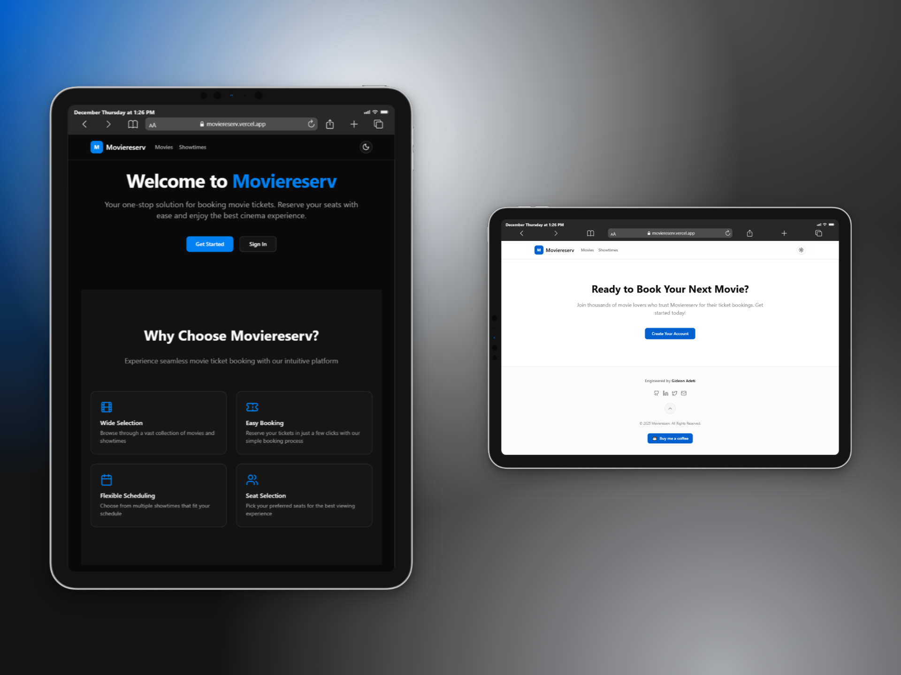
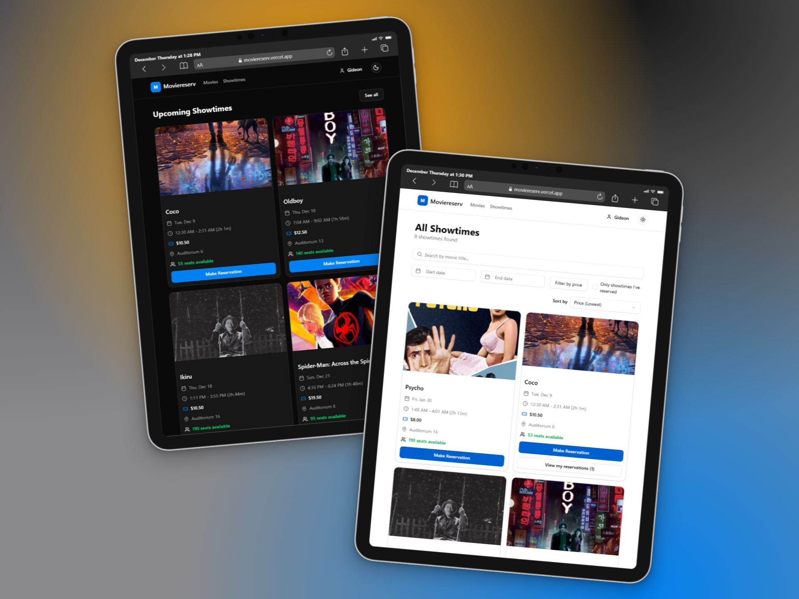
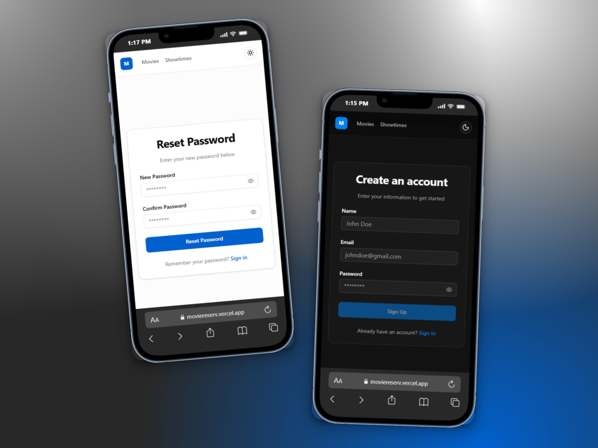
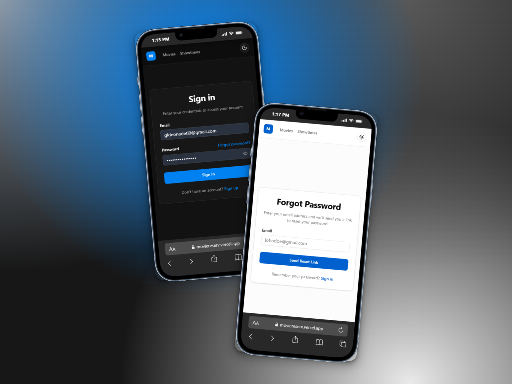

# Moviereserv

A modern, responsive web application for booking movie tickets. Built with Next.js and featuring a beautiful UI with dark mode support, real-time seat selection, and seamless movie browsing powered by The Movie Database (TMDB) API. This frontend client communicates with the [movie-reservation-system](https://github.com/gideonadeti/movie-reservation-system) backend API to provide a complete movie ticket reservation experience.

[Live Demo](https://moviereserv.vercel.app) | [Video Walkthrough](https://youtu.be/uXvKouVCD5s)

## Table of Contents

- [Moviereserv](#moviereserv)
  - [Table of Contents](#table-of-contents)
  - [Features](#features)
    - [User Authentication](#user-authentication)
    - [Movie Browsing](#movie-browsing)
    - [Showtime Management](#showtime-management)
    - [Reservation System](#reservation-system)
    - [User Experience](#user-experience)
    - [Additional Features](#additional-features)
  - [Screenshots](#screenshots)
    - [Desktop (MacBook Air)](#desktop-macbook-air)
    - [Tablet (iPad Pro 11")](#tablet-ipad-pro-11)
    - [Mobile (iPhone 13 Pro)](#mobile-iphone-13-pro)
  - [Technologies Used](#technologies-used)
    - [Core Framework](#core-framework)
    - [State Management \& Data Fetching](#state-management--data-fetching)
    - [UI Components \& Styling](#ui-components--styling)
    - [Forms \& Validation](#forms--validation)
    - [HTTP Client](#http-client)
    - [Date Handling](#date-handling)
    - [Notifications](#notifications)
    - [Development Tools](#development-tools)
  - [Running Locally](#running-locally)
    - [Prerequisites](#prerequisites)
    - [Environment Variables](#environment-variables)
    - [Installation Steps](#installation-steps)
  - [Deployment](#deployment)
    - [Vercel Deployment (Recommended)](#vercel-deployment-recommended)
  - [Contributing](#contributing)
    - [Development Guidelines](#development-guidelines)
  - [Support](#support)
  - [Acknowledgements](#acknowledgements)

## Features

### User Authentication

- **Sign Up & Sign In** - Secure user registration and authentication
- **Password Reset** - Email-based password recovery
- **Persistent Sessions** - Automatic token refresh for seamless user experience
- **Account Deletion** - Users can delete their accounts

### Movie Browsing

- **Browse Movies** - Explore a vast collection of movies from TMDB
- **Movie Details** - View detailed information, cast, and synopsis
- **Genre Filtering** - Filter movies by genre
- **Search Functionality** - Find movies quickly

### Showtime Management

- **View Showtimes** - See all available showtimes with filtering options
- **Date Filtering** - Filter showtimes by date
- **Movie Filtering** - Filter showtimes by specific movies
- **Sorting Options** - Sort by time, price, and more
- **Upcoming Showtimes** - Dashboard showing next 4 upcoming showtimes

### Reservation System

- **Seat Selection** - Interactive seat map for selecting seats
- **Real-Time Availability** - See which seats are already reserved
- **Multiple Seat Booking** - Reserve multiple seats in one transaction
- **Reservation History** - View all past and upcoming reservations
- **Cancel Reservations** - Cancel reservations when needed

### User Experience

- **Dark Mode** - Toggle between light and dark themes
- **Responsive Design** - Works seamlessly on desktop, tablet, and mobile
- **Loading States** - Smooth loading indicators
- **Error Handling** - User-friendly error messages
- **Toast Notifications** - Beautiful notification system for user feedback

### Additional Features

- **Landing Page** - Attractive landing page for unauthenticated users
- **Protected Routes** - Secure page access with authentication guards
- **Optimistic Updates** - Instant UI updates for better UX
- **Image Optimization** - Optimized movie poster images

## Screenshots

### Desktop (MacBook Air)

.png)
.png)
.png)

### Tablet (iPad Pro 11")




### Mobile (iPhone 13 Pro)




## Technologies Used

### Core Framework

- **Next.js 16** - React framework with App Router
- **React 19** - UI library with React Compiler
- **TypeScript** - Type-safe development

### State Management & Data Fetching

- **TanStack Query** - Powerful data synchronization and caching
- **Zustand** - Lightweight state management

### UI Components & Styling

- **Radix UI** - Accessible component primitives
  - Alert Dialog, Checkbox, Dialog, Dropdown Menu
  - Label, Popover, Select, Separator, Slider, Tooltip
- **Tailwind CSS** - Utility-first CSS framework
- **Lucide React** - Beautiful icon library
- **next-themes** - Theme switching (dark mode)

### Forms & Validation

- **React Hook Form** - Performant forms with easy validation
- **Zod** - Schema validation
- **@hookform/resolvers** - Zod resolver for React Hook Form

### HTTP Client

- **Axios** - Promise-based HTTP client

### Date Handling

- **date-fns** - Modern JavaScript date utility library
- **react-day-picker** - Flexible date picker component

### Notifications

- **Sonner** - Toast notification library

### Development Tools

- **Biome** - Fast formatter and linter
- **Babel React Compiler** - Optimized React compilation

## Running Locally

### Prerequisites

- Node.js (v20 or higher)
- npm or bun package manager
- Backend API running (see [movie-reservation-system](../movie-reservation-system/README.md))
- TMDB API credentials

### Environment Variables

Create a `.env.local` file in the root directory with the following variables:

```env
# Backend API
NEXT_PUBLIC_BACKEND_BASE_URL="http://localhost:3000/api/v1"

# TMDB API Configuration
NEXT_PUBLIC_TMDB_API_BASE_URL="https://api.themoviedb.org/3"
NEXT_PUBLIC_TMDB_BEARER_TOKEN="your-tmdb-bearer-token"
NEXT_PUBLIC_TMDB_ACCOUNT_ID="your-tmdb-account-id"
NEXT_PUBLIC_TMDB_SECURE_IMAGE_BASE_URL="https://image.tmdb.org/t/p/w500"
```

### Installation Steps

1. **Clone the repository**

   ```bash
   git clone <repository-url>
   cd moviereserv
   ```

2. **Install dependencies**

   ```bash
   npm install
   # or
   bun install
   ```

3. **Start the development server**

   ```bash
   npm run dev
   # or
   bun run dev
   ```

4. **Open your browser**
   - Navigate to `http://localhost:3001`
   - The application will automatically reload when you make changes

## Deployment

### Vercel Deployment (Recommended)

1. **Push your code to GitHub**

2. **Import project to Vercel**
   - Go to [Vercel](https://vercel.com)
   - Click "New Project"
   - Import your repository

3. **Configure environment variables**
   - Add all `NEXT_PUBLIC_*` environment variables in Vercel dashboard
   - Ensure backend URL points to your production API

4. **Deploy**
   - Click on Deploy
   - Note: Vercel will automatically deploy on every push to main branch

## Contributing

Contributions are welcome! Please follow these steps:

1. Fork the repository
2. Create a feature branch (`git checkout -b feature/amazing-feature`)
3. Commit your changes (`git commit -m 'Add some amazing feature'`)
4. Push to the branch (`git push origin feature/amazing-feature`)
5. Open a Pull Request

### Development Guidelines

- Follow the existing code style and use Biome for formatting
- Use TypeScript for all new files
- Ensure responsive design works on all screen sizes
- Test dark mode compatibility
- Write meaningful component and function names
- Keep components focused and reusable

## Support

If you find this project helpful or interesting, consider supporting me:

[☕ Buy me a coffee](https://buymeacoffee.com/gideonadeti)

## Acknowledgements

This project is inspired by the [roadmap.sh](https://roadmap.sh) [Movie Reservation System](https://roadmap.sh/projects/movie-reservation-system) challenge.

Built with open-source technologies:

- [Next.js](https://nextjs.org/) - The React framework
- [Radix UI](https://www.radix-ui.com/) - Accessible component primitives
- [Tailwind CSS](https://tailwindcss.com/) - Utility-first CSS framework
- [TanStack Query](https://tanstack.com/query) - Powerful data synchronization
- [Lucide](https://lucide.dev/) - Beautiful icon library

Movie data provided by [The Movie Database (TMDB)](https://www.themoviedb.org/).
